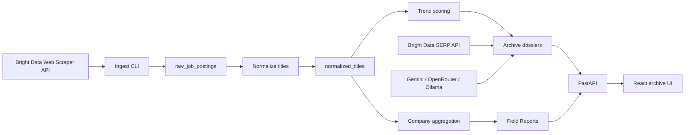
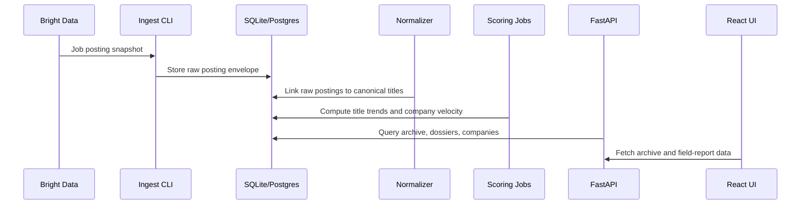
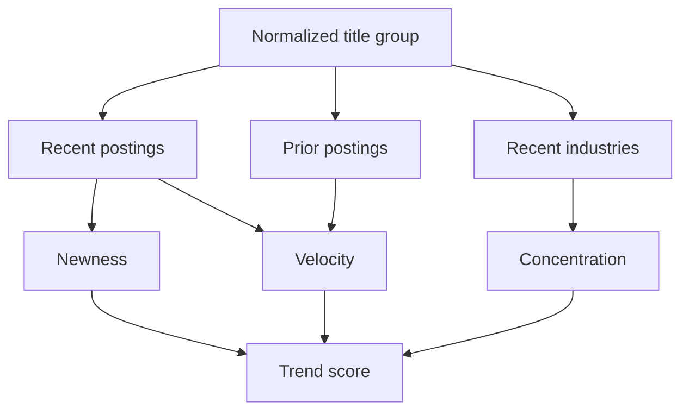
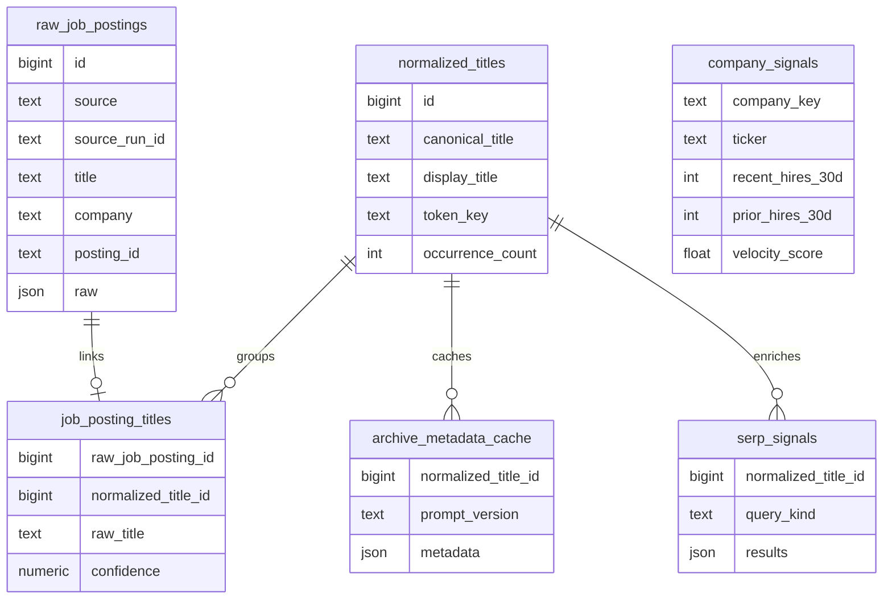
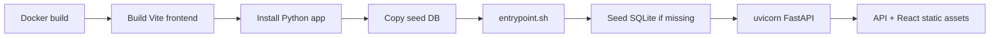

# Job Title Archaeology

Alternative-data hiring intelligence for emerging job titles and company hiring signals. Built for Web Data UNLOCKED hackathon, Track 2: Finance & Market Intelligence.

Job postings leak hiring intent before earnings calls, analyst reports, and labor-market summaries. Job Title Archaeology turns Bright Data job-listing snapshots into an editorial intelligence archive: which companies are hiring, which titles are accelerating, and where new operating roles are emerging.

## Demo

- Live app: https://archaeologist.onrender.com/
- Repository: https://github.com/Hitchgernn/job-title-archaeology

## Product surface

| View | Purpose |
|---|---|
| Landing page | Editorial overview of the archive and market-intelligence workflow |
| Archive | Search and filter emerging job titles detected from posting data |
| Dossier | Inspect a title's adoption timeline, early adopters, competencies, sector density, outlook, and SERP signals |
| Field Reports | Compare company-level hiring velocity and top roles |
| CSV export | Export filtered archive records for reuse in research workflows |

## Core capabilities

- Ingests Indeed and LinkedIn job postings through Bright Data Web Scraper API.
- Normalizes messy raw titles by stripping location suffixes, IDs, shift markers, parenthetical noise, and duplicated variants.
- Scores title momentum by newness, velocity, and sector concentration.
- Aggregates company-level hiring velocity across rolling 30-day windows.
- Resolves tracked tickers from raw company names for finance-oriented reports.
- Enriches top trends with Bright Data SERP press signals.
- Generates archive metadata with Gemini, OpenRouter, or Ollama providers.
- Serves a newspaper-styled React archive from the FastAPI backend.

## System architecture



## Data flow



## Bright Data integration

| Product | Code path | Role |
|---|---|---|
| Web Scraper API | `backend/ingest/sources/brightdata.py` | Starts dataset runs, polls snapshot progress, fetches Indeed/LinkedIn job listings |
| SERP API | `backend/serp/client.py` | Fetches open-web press signals for emerging title dossiers |

Snapshots dedupe on `(source, posting_id)` so repeat collection runs can preserve time-series signals without duplicating the same posting.

## Scoring model



Trend score combines:

| Signal | Meaning |
|---|---|
| Newness | Recent postings exist while prior window has none |
| Velocity | Recent count compared with prior weekly rate |
| Concentration | Spread across industries/sectors |

Company reports use recent versus prior 30-day hiring counts to surface hiring acceleration by employer.

## API endpoints

| Route | Purpose |
|---|---|
| `GET /health` | Liveness check |
| `GET /archive/titles?limit=50` | Trending normalized titles |
| `GET /archive/titles/{record_id}` | Full dossier with adoption velocity, sector density, early adopters, and SERP signals |
| `GET /companies?limit=20` | Company hiring leaderboard |
| `GET /companies/{ticker_or_key}` | Per-company weekly hires and top roles |
| `GET /dashboard/trends?limit=5` | Legacy scored trend cards |

## Local setup

```bash
pip install -e ".[dev]"
npm --prefix frontend ci
cp .env.example .env
python init_db.py
```

Fill required environment variables in `.env`:

```bash
BRIGHTDATA_API_TOKEN=
BRIGHTDATA_WEB_SCRAPER_ID_INDEED=
BRIGHTDATA_WEB_SCRAPER_ID_LINKEDIN=
GEMINI_API_KEY=
DATABASE_URL=sqlite:///job_title_archaeology.db
```

Run backend and frontend:

```bash
uvicorn backend.app.main:app --reload --port 8000
npm --prefix frontend run dev
```

## CLI commands

```bash
# Trigger fresh keyword snapshot from Indeed
python -m backend.ingest.cli discover \
  --source indeed \
  --keywords "AI Workflow Architect,Climate Risk Modeler,Clinical AI Safety Officer" \
  --locations "United States" \
  --limit-per-input 200

# Resume a Bright Data snapshot by id
python -m backend.ingest.cli resume --snapshot-id sd_xxxx

# Import a local Bright Data JSON export
python -m backend.ingest.cli import-json data/raw/sample.json

# Generate editorial metadata and sector breakdowns
python -m backend.archive.cli generate --limit 50 --provider gemini --request-delay 2

# Generate archive images
python -m backend.archive.cli generate-images --limit 10

# Enrich top titles with SERP press signals
python -m backend.archive.cli enrich-serp --limit 30

# Recompute company hiring leaderboard
python -m backend.companies.cli recompute
```

## Data model



## Deployment

Render deployment uses a single Docker image:



Render settings:

| Setting | Value |
|---|---|
| Runtime | Docker |
| Dockerfile | `./Dockerfile` |
| Health check | `/health` |
| Demo DB | `sqlite:////app/runtime/job_title_archaeology.db` |
| Static UI | Served by FastAPI from `frontend/dist` |

`fly.toml` is also included for Fly.io deployments.

## Planned automation

Future development can use n8n to orchestrate:

- Scheduled Bright Data scraping.
- Normalization and trend scoring jobs.
- SERP enrichment runs.
- Company signal recomputation.
- Data refresh notifications.

This would make the pipeline repeatable without manually running CLI commands.

## Tests

```bash
python -m pytest
npm --prefix frontend test -- --run
```

Test coverage includes:

- Bright Data ingest client and retry/error behavior.
- JSONL and database sinks.
- Title normalization rules.
- Trend scoring and weekly buckets.
- Archive metadata cache and router behavior.
- Company aggregation and ticker resolution.
- SERP cache round-trip.
- React routing, filtering, CSV export, landing page, and dossier image behavior.

## Project layout

```text
backend/
  app/main.py            FastAPI entrypoint, static frontend serving
  archive/               Dossier rendering, metadata cache, image generation
  companies/             Company hiring velocity aggregation
  dashboard/             Legacy scored trend cards
  db/                    SQLite/Postgres connection and migrations
  ingest/                Bright Data client, config, JSONL and DB sinks
  narratives/            Gemini, OpenRouter, and Ollama providers
  normalize/             Rule-based title cleanup
  serp/                  Bright Data SERP client and cache
  trends/                Grouping, scoring, and weekly bucket queries
frontend/src/            React + Vite archive UI
configs/                 Bright Data collection defaults
data/seed/               SQLite snapshot bundled into deployment image
Dockerfile               Single-image backend + frontend build
entrypoint.sh            Runtime DB seed + uvicorn startup
render.yaml              Render Blueprint config
fly.toml                 Fly.io config
```

## Stack

| Layer | Technology |
|---|---|
| Backend | Python 3.11+, FastAPI, Pydantic v2, Typer, httpx, psycopg |
| Frontend | React, Vite, TypeScript, Vitest, Testing Library |
| Database | SQLite by default, Postgres-compatible via `DATABASE_URL` |
| Data providers | Bright Data Web Scraper API, Bright Data SERP API |
| Enrichment | Gemini 2.5 Flash, OpenRouter, local Ollama |
| Deployment | Docker, Render, optional Fly.io |

## License

Hackathon submission. Not yet licensed for redistribution.
